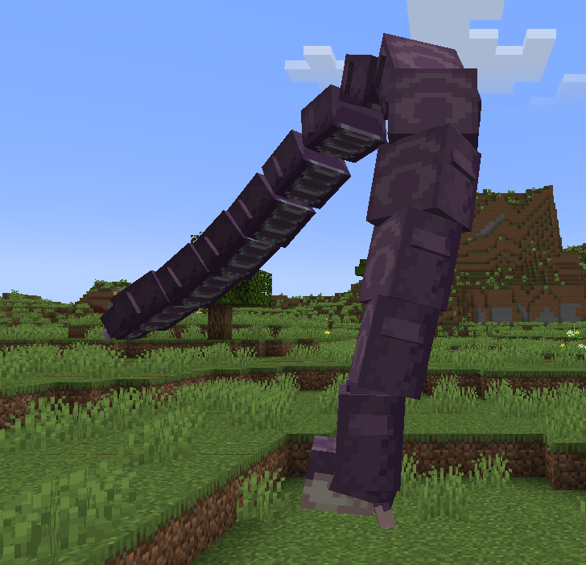
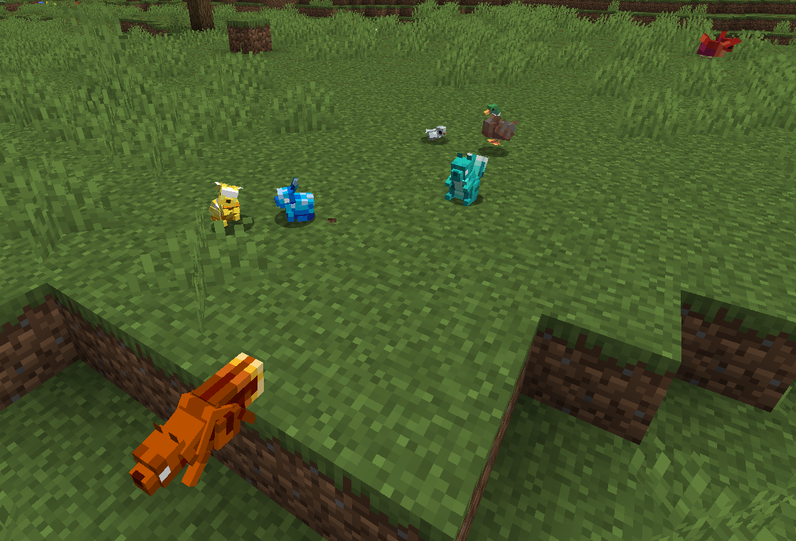
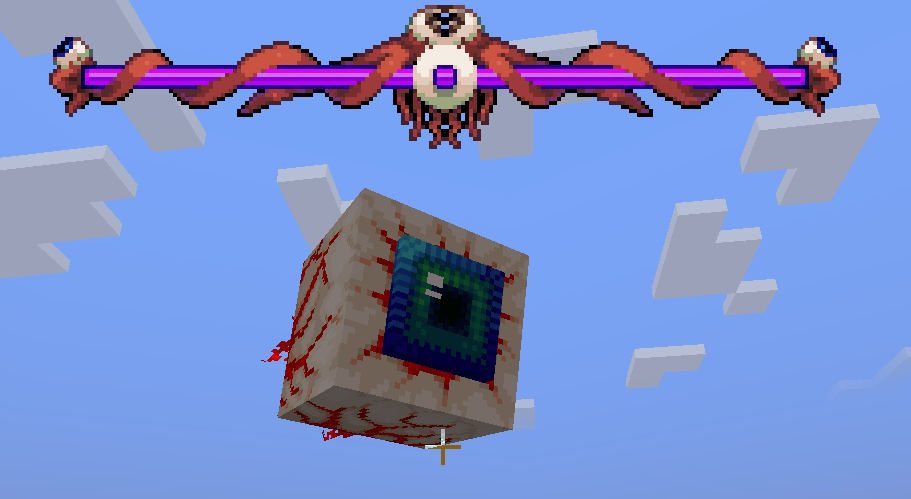
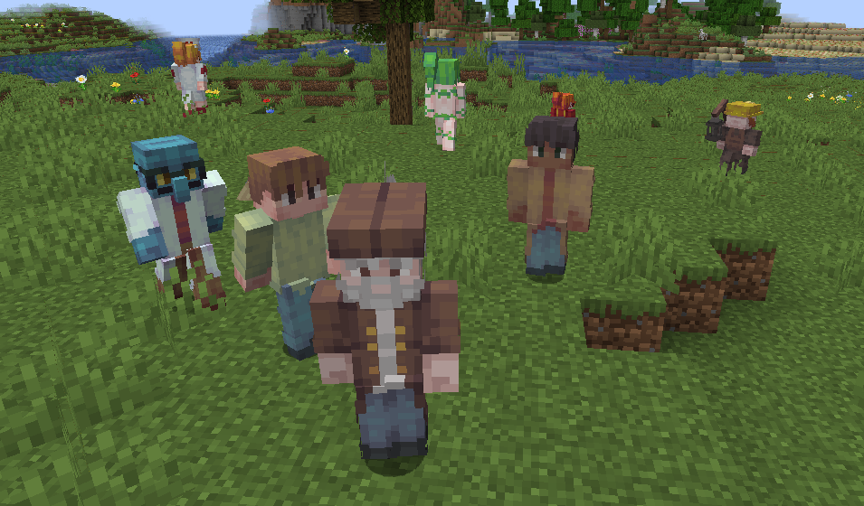
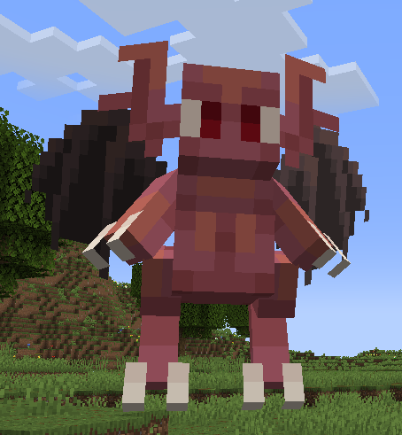
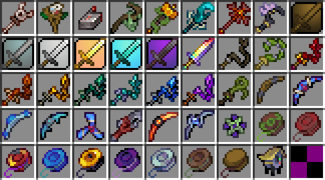
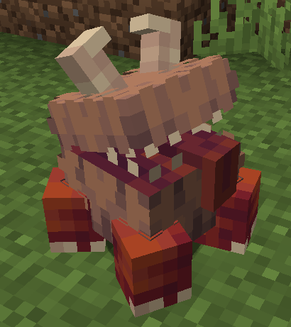
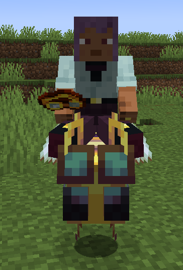
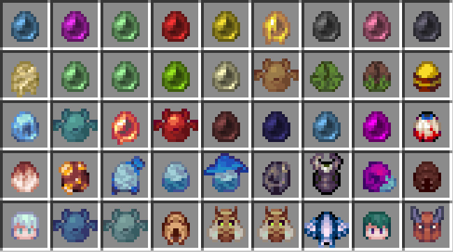
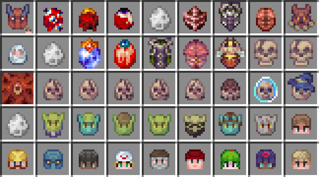

# 泰拉生物 -- 汇流来世的生物子模块

语言: [中文](./README_zh.md) | [English](./README.md)
___ 
##  模组内容

- **[生物](#-生物-)**
  - [怪物](#怪物-)
  - [动物](#动物-)
  - [Boss](#boss-)
  - [NPC](#npc-)
  - [召唤物](#召唤物-)

- **物品**
  - **[武器](#-武器-)**
    - [悠悠球](#悠悠球-)
    - [回旋镖](#回旋镖-)
    - [召唤杖](#召唤杖-)
    - [鞭子](#鞭子-)

  - **[附魔书](#-附魔书-)**
    - [横扫之鞭](#横扫之鞭-)
    - [影分身](#影分身-)
  
  - **[工具](#-工具-)**
    - [房屋检测工具](#房屋检测工具-)
    - [宠物](#宠物-)
    - [坐骑](#坐骑-)

  - **[刷怪蛋](#-刷怪蛋)**
  
- **[游戏机制](#-游戏机制)**
  - [NPC系统](#npc系统-)
  - [召唤师系统](#召唤师系统-)
  - [配置文件](#配置文件-)

___
## 🥚 生物 

### 怪物 😈

  

- 史莱姆 14种
- 恶魔眼 14变种
- 蝙蝠 5种
- 哥布林 7种
- 地牢骷髅 7种
- 蠕虫 3种
- 黄蜂
- 飞鱼、喀迈拉、噬魂怪、滴滴怪、游荡眼球怪
- 巨型卷壳怪 2变种
- 变种僵尸 4种
- 腐骴
- 蚁狮蜂 2种
- 宁芙
- 鸟妖
- 恶魔 2种
- 幽灵
- 雪怪
- 火焰小鬼
- 血腥芽孢
- 血爬虫
- 诅咒骷髅头
- 食人怪、抓人草
- 食人鱼

### 动物 🐰

  

- 鸭子
- 松鼠 2变种
- 宝石松鼠 8变种
- 兔子
- 宝石兔子 8变种
- 鸟 3种

### Boss 🤡

  

- 史莱姆之王
- 克苏鲁之眼
- 世界吞噬者
- 蜂后
- 骷髅王
- 血肉之墙

### NPC 😆

  

- 向导、商人、护士、哥布林工匠、爆破商、武器商、渔夫等 共17种

### 召唤物 🐣

  

- 雀杖
- 铁傀儡召唤杖
- 史莱姆宝宝
- 仆役黄蜂
- 幽匿法杖
- 小鬼法杖
- 雪怪法杖
- 召唤的剑 6种
- 泰拉棱镜

---
## ⚔️ 武器 

  

### 悠悠球 🪀

鼠标长按射出，鼠标轮滚改变射程。可以锁定距离最近的指针指向的目标。

### 回旋镖 🪃

右键射出，飞行一段时间返回玩家手中。

### 召唤杖 🪄

右键召唤召唤物，召唤物会攻击敌人。长按右键可以收回所有召唤物。

### 鞭子 🪢

右键鞭打范围内所有目标，使得召唤杖对目标造成额外伤害。

---
## 📕 附魔书 

### 横扫之鞭  

鞭子可以横扫范围内所有目标。

### 影分身  

可以额外射出一个回旋镖。

---
## 🔧 工具 

### 房屋检测工具 🏠

拥有三种模式：检测房屋、添加房屋（需要提前检测）、删除房屋。右键NPC添加房屋，使得NPC可以入住。

### 宠物 🐕

- 切斯特、钱币槽：可以远程连接容器、末影箱。

  

### 坐骑 🐎

右键召唤宠物坐骑，按下**shift**可以收回宠物。
- 粘鞍
- 涂蜜护目镜

  

--- 
## 🥚 刷怪蛋

    
    

---
## 📖 游戏机制
### NPC系统 🙋‍♂️
- 交易 (data/terra_entity/npc/shop/)
- 心情 (data/terra_entity/npc/moods.json)
- 对话 (data/terra_entity/npc/dialogs.json)
- 交流(data/terra_entity/npc/chat/)
- 姓名 (data/terra_entity/npc/names.json)

### 召唤师系统 🧙🏻
- 召唤伤害: 鞭子和召唤物造成的基础伤害
- 标记伤害: 手持鞭子时召唤物造成额外伤害
- 仆从栏位: 召唤物的最大数量

### 配置文件 ⚙️
- 通用配置 (config/terra_entity-common.toml)
- 客户端配置 (config/terra_entity-client.toml)
- 属性配置 (config/terra_entity/attribute_config.json)

